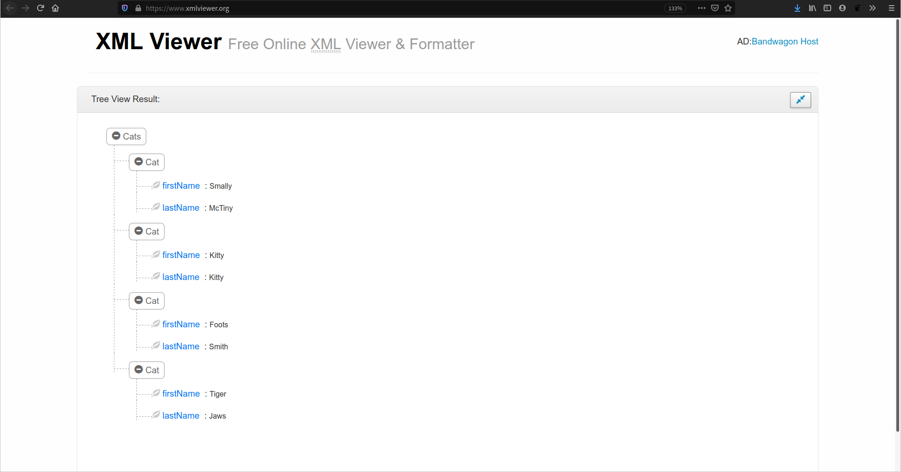
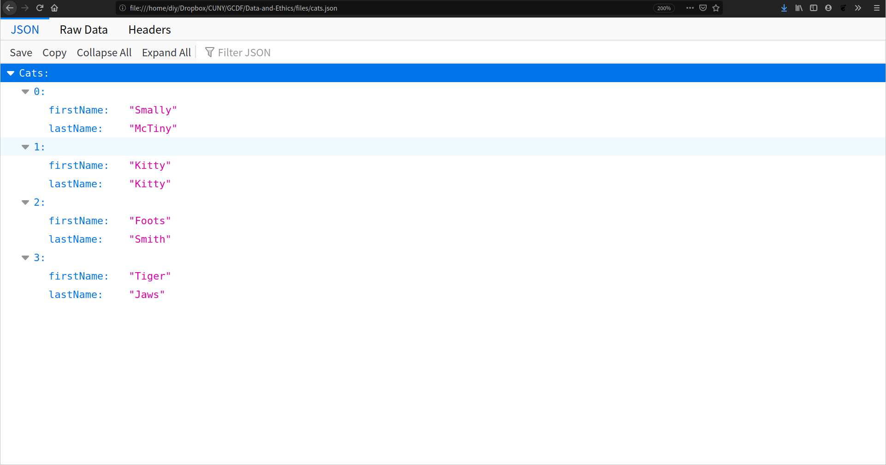
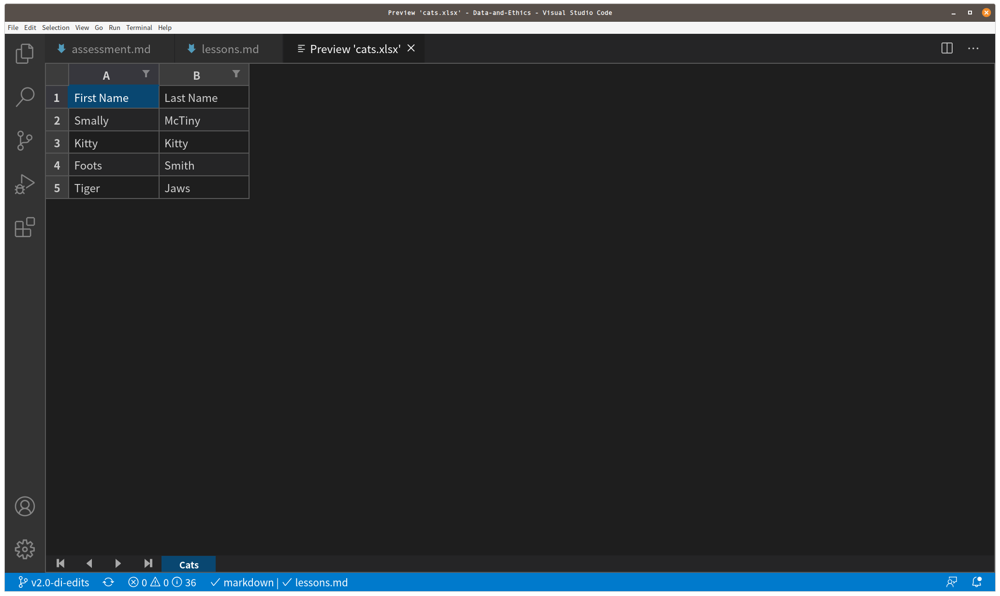

← [Stages of Data: Raw](03-stages-of-data-raw.md)&nbsp;&nbsp;&nbsp;|&nbsp;&nbsp;&nbsp;[Side Note on Data Structures: Tidy Data](05-side-note-on-data-structures-tidy-data.md) →

---

# 4. Stages of Data: Processed/Transformed

Processing data puts it into a state more readily available for analysis and makes the data legible. For instance, it could be rendered as **structured data**. This can also take many forms, e.g., a table. Here are a few you're likely to come across, all representing the same data:

## XML

**XML** or eXstensible Markup Language, uses a nested structure, where the "tags" like `<Cat>` contain other tags inside them, like `<firstName>`. This format is good for organizing the layout of a document in a tree-like format, just like HTML, where we want to nest elements like a sentence within a paragraph, for example. XML does not carry any information about how to be displayed and can be used in a variety of presentation scenarios.

```xml
<Cats>
    <Cat>
        <firstName>Smally</firstName>
        <lastName>McTiny</lastName>
    </Cat>
    <Cat>
        <firstName>Kitty</firstName>
        <lastName>Kitty</lastName>
    </Cat>
    <Cat>
        <firstName>Foots</firstName>
        <lastName>Smith</lastName>
    </Cat>
    <Cat>
        <firstName>Tiger</firstName>
        <lastName>Jaws</lastName>
    </Cat>
</Cats>
```


This file is viewed on an online [XML Viewer](https://www.xmlviewer.org/). If you would like to, you can either copy the code chunk above to try it out on [XML Viewer](https://www.xmlviewer.org) or [download the XML file](https://raw.githubusercontent.com/DHRI-Curriculum/data-literacies/v2.0/files/cats.xml) to try it out in other viewers. To save the file onto your local computer, **right click** on `Raw` button (top right-hand corner of the data set) and click `Save Link As...` to save the file onto your local computer.

For example, after downloading the file, can you try to open this file in your browser? (Psst! Try right clicking on `cats.xml` in your local directory and choosing `Open with Other Application` in the drop down menu to select the browser of your choice.)

## JSON

**JSON** or JavaScript Object Notation, also uses a nesting structure, but with the addition of *key/value* pairs, like the `"firstName"` *key* which is tied to the `Smally` *value* (at least for the first cat!). JSON is popular with web applications that save and send data from your browser to web servers, because it uses the main language of web browsers, JavaScript, to work with data.

```json
{
    "Cats": [
        {
            "firstName": "Smally",
            "lastName": "McTiny"
        },
        {
            "firstName": "Kitty",
            "lastName": "Kitty"
        },
        {
            "firstName": "Foots",
            "lastName":"Smith"
        },
        {
            "firstName": "Tiger",
            "lastName":"Jaws"
        }
    ]
} 
```


This file is viewed on my Firefox browser from my local directory. To view it in your browser, you can drag and drop the local file onto a open tab or window. You can also [download the JSON file](https://raw.githubusercontent.com/DHRI-Curriculum/data-literacies/v2.0/files/cats.json) and try opening it in other viewers (e.g. R Studio, webviewers like Code Beautify's [JSON Viewer](https://codebeautify.org/jsonviewer)). To save the file onto your local computer, **right click** on `Raw` button (top right-hand corner of the data set) and click `Save Link As...` to save the file onto your local computer.

## CSV

**CSV** or Comma Separated Values uses—you guessed it!—commas to separate values. Each line (First Name, Last Name) is a new "record" and each column (separated by a comma) is a new "field." This data format stores tabular data in a clean way that facilitates the transfer between different data architectures. As data types go, it is very rudimentary (even predating computers!) and is easy to type, without needing special characters beyond a comma.

```
First Name,Last Name
Smally,McTiny
Kitty,Kitty
Foots,Smith
Tiger,Jaws
```



This file is viewed on my VSCode with the extension `Excel Viewer`. To view in VSCode, [install the extension](https://marketplace.visualstudio.com/items?itemName=GrapeCity.gc-excelviewer) in VSCode, open the .csv, and then right click on the file and click `Open Preview`. You can also [download the CSV file](https://raw.githubusercontent.com/DHRI-Curriculum/data-literacies/v2.0/files/cats.csv) to open it in other viewers (e.g. Microsoft Excel, Notepad). To save the file onto your local computer, **right click** on `Raw` button (top right-hand corner of the data set) and click `Save Link As...` to save the file onto your local computer.

## The Importance of Using Open Data Formats

A small detour to discuss data formats. Open data formats are usually available to anyone free-of-charge and allows for easy reusability. Proprietary formats often hold copyrights, patents, or have other restrictions placed on them, and are dependent on (expensive) licensed softwares. If the licensed software cease to support its proprietary format or it becomes obsolete, you may be stuck with a file format that cannot be easily open or (re)used (e.g. .mac). For accessibility, future-proofing, and preservation, keep your data in open, sustainable formats. A demonstration:

1. Open [this file](https://raw.githubusercontent.com/DHRI-Curriculum/data-literacies/v2.0/files/cats.csv) in a [text editor](https://github.com/DHRI-Curriculum/insights/blob/v2.0/pages/choosing-a-text-editor.md) (e.g. Visual Studio Code, TextEdit (macOS), NotePad (Windows) ), and then in an app like Excel. This is a CSV, an open, text-only, file format. To save the file onto your local computer, right click on `cats.csv` and click `Save Link As` to download the file to your local computer (it's the same cats.csv from above!)
2. Now do the same with [this Excel file](https://github.com/DHRI-Curriculum/data-literacies/blob/v2.0/files/cats.xlsx?raw=true). Unlike the previous, this is a proprietary format!

Sustainable formats are generally unencrypted, uncompressed, and follow an open standard.

<table>
    <caption>A small list of open formats (more information of each file format is linked in their entries):</caption>
    <tr>
        <th>Types of multimedia</th>
        <th>Examples</th>
        <th>Common file extensions</th>
    </tr>
    <tr>
        <th rowspan="3">Images</th>
        <td><a href="https://www.lifewire.com/tif-tiff-file-2622393">TIFF</a> (Tagged Image File Format) </td>
        <td>`.tiff`, `.tif`</td>
    </tr>
    <tr>
        <td><a href="https://en.wikipedia.org/wiki/JPEG_2000">JPEG2000</a></td>
        <td>`.jp2`, `.jpf`, `.jpx`</td>
    </tr>
    <tr>
        <td><a href="http://www.libpng.org/pub/png/pngintro.html">PNG</a> (Portable Network Graphics)</td>
        <td>`.png`</td>
    </tr>
    <tr>
        <th rowspan="3">Text</th>
        <td><a href="https://help.ceda.ac.uk/article/4429-ascii-formats">ASCII</a>  (American Standard Code for Information Interchange)</td>
        <td>`.ascii`, `.dat`, `.txt`</td>
    </tr>
    <tr>
        <td><a href="https://en.wikipedia.org/wiki/PDF">PDF</a> (Portable Document Format)</td>
        <td>`.pdf`</td>
    </tr>
    <tr>
        <td><a href="https://en.wikipedia.org/wiki/Comma-separated_values">CSV</a> (Comma-Separated Values</td>
        <td>`.csv`</td>
    </tr>
    <tr>
        <th rowspan="2">Audio</th>
        <td><a href="https://xiph.org/flac/index.html">FLAC</a> (Free Lossless Audio Codec)</td>
        <td>`.flac`</td>
    </tr>
        <tr>
        <td><a href="https://xiph.org/ogg/">ogg</a></td>
        <td>`.ogg`</td>
    </tr>
    <tr>
        <th rowspan="1">Video</th>
        <td><a href="https://www.lifewire.com/mp4-file-2622024">MPEG-4</a></td>
        <td>`.mp4`</td>
    </tr>
    <tr>
        <th rowspan="3">Others</th>
        <td><a href="https://www.w3schools.com/xml/xml_whatis.asp">XML</a> (Extensible Markup Language)</td>
        <td>`.xml`</td>
    </tr>
    <tr>
        <td><a href="https://www.json.org/json-en.html">JSON</a> (JavaScript Object Notation</td>
        <td>`.json`</td>
    </tr>
    <tr>
        <td><a href="https://www.3dsystems.com/quickparts/learning-center/what-is-stl-file">STL</a> (STereoLithography file format—used in 3D modeling)</td>
        <td>`.stl`</td>
    </tr>
    <tr>
        <th colspan="3"> For a list of file formats, consider the Library of Congress' list of <a href="https://www.loc.gov/preservation/digital/formats/fdd/browse_list.shtml#"> Sustainability of Digital Formats</a>.</th>
    <tr>
</table>

## Evaluation

Structured data can be:
- a XML list.*
- a Excel table.*
- an email chain.
- a collection of text files.

We may choose to store our data in open data formats because they:
- are sustainable.
- allow for easy reusability.
- are free-of-charge to use.
- All of the above.*

## Challenge: Processed/Transformed

1. How do you decide the formats to store your data when you transition from 'raw' to 'processed/transformed' data? What are some of your considerations?
2. Explore the `moSmall.csv` dataset, what questions might you ask with this dataset? What columns (variables) will you keep?
3. If you are saving the file `moSmall.csv` in a proprietary spreadsheet application like Microsoft Excel (Windows/macOS) or Numbers (macOS), you may be prompted to save the file as `.xlsx` or `.numbers`. What format would you choose to save it in? Why would you choose to do so?

## Solution:

1. I usually go with the conventions of the field as it allows me to share my "in progress" work easily with my research lab and collaborators. The file conventions can range from `.csv` to `.json`.
2. I will keep columns (variables) relevant to my question, such as the `Artist Gender`, `Is Public Domain` and `Rights and Reproduction` columns. I will also keep some of the descriptive columns such as `Object ID` and `Artist Role` to help contextualize the results (e.g. what kind of roles do female artists tend to take on?)
3. I will choose to keep it in a `.csv` file type as it can be opened up by more programs and if Microsoft stops supporting `.xlsx` file types I may no longer have access to opening the dataset. **or** I will choose to switch to a `.xlsx` format as it is easier to use on a graphical user interface like Microsoft Excel. Any stylistic changes I've made to the file will remain as well, such as alternative highlighting rows for readability or bolding column headings.

## Keywords

Do you remember the glossary terms from this section?

- [CSV (file format)](https://github.com/DHRI-Curriculum/glossary/blob/v2.0/terms/csv.md)
- [XML (file format)](https://github.com/DHRI-Curriculum/glossary/blob/v2.0/terms/xml.md)
- [JSON (file format)](https://github.com/DHRI-Curriculum/glossary/blob/v2.0/terms/json.md)
- [Open Data Formats](https://github.com/DHRI-Curriculum/glossary/blob/v2.0/terms/open-data-formats.md)

---

← [Stages of Data: Raw](03-stages-of-data-raw.md)&nbsp;&nbsp;&nbsp;|&nbsp;&nbsp;&nbsp;[Side Note on Data Structures: Tidy Data](05-side-note-on-data-structures-tidy-data.md) →