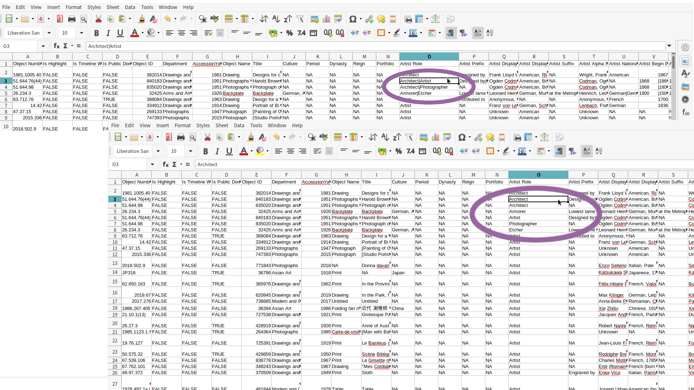

← [Stages of Data: Processed/Transformed](04-stages-of-data-processedtransformed.md)&nbsp;&nbsp;&nbsp;|&nbsp;&nbsp;&nbsp;[More Stages of Data: Cleaned](06-more-stages-of-data-cleaned.md) →

---

# 5. Side Note on Data Structures: Tidy Data

There are different guidelines to the processing of data, one of which is the **[Tidy Data](https://www.jstatsoft.org/article/view/v059i10)** format, which follows these rules in structuring data:

1. Each variable is in a column.
2. Each observation is a row.
3. Each value is a cell.

Look back at our example of cats to see how they may or may not follow those guidelines. **Important note:** some data formats allow for more than one dimension of data (like the `JSON` structure below). How might that complicate the concept of **Tidy Data**?

```json
{
    "Cats": [
            {
                "Calico": [
                    {
                        "firstName": "Smally",
                        "lastName":"McTiny"
                    },
                    {
                        "firstName": "Kitty",
                        "lastName": "Kitty"
                    }
                ],
                "Tortoiseshell": [
                    {
                        "firstName": "Foots",
                        "lastName":"Smith"
                    },
                    {
                        "firstName": "Tiger",
                        "lastName":"Jaws"
                    }
                ]
            }
        ]
}
```

While tiny data is a really popular method of structuring and organizing data, it is not the only way to do so. Depending on the type of data you have, it is also not always the best way to structure data. 

## Evaluation

Tiny data format only allows one value per cell.
- True*
- False

Do you think you can explain the rules of tidy data structuring?

## Challenge: Tidy Data
1. Looking at the `moSmall.csv` dataset, there are a couple of columns with nested information that don't follow the rules of tidy data. Can you identify at least two of the columns that demonstrates this?
2. Would you convert `moSmall.csv` to follow the tidy data format? Can you demonstrate how you would do so?

## Solution
1. `Artist Role`, `Artist Display Name`, `Artist Display Bio`, `Artist Alpha Sort`, `Artist Nationality`, `Artist Begin Date`, `Artist End Date`, or `Classification`.
2. I will choose to convert to the tidy data format if I was interested in any of the variables listed above, so that it will be easier to analyse the entries. I will have to unnest the entries by separating the data into different rows. For example, if I am interested in understanding the type of roles that are predominantly held by non-cisgender men, I will unnest the column `Artist Role`. An entry like `Architect|Artist` will be separated into two rows as illustrated in this example:



## Keywords

Do you remember the glossary terms from this section?

- [Tidy Data](https://github.com/DHRI-Curriculum/glossary/blob/v2.0/terms/tidy-data.md)

---

← [Stages of Data: Processed/Transformed](04-stages-of-data-processedtransformed.md)&nbsp;&nbsp;&nbsp;|&nbsp;&nbsp;&nbsp;[More Stages of Data: Cleaned](06-more-stages-of-data-cleaned.md) →