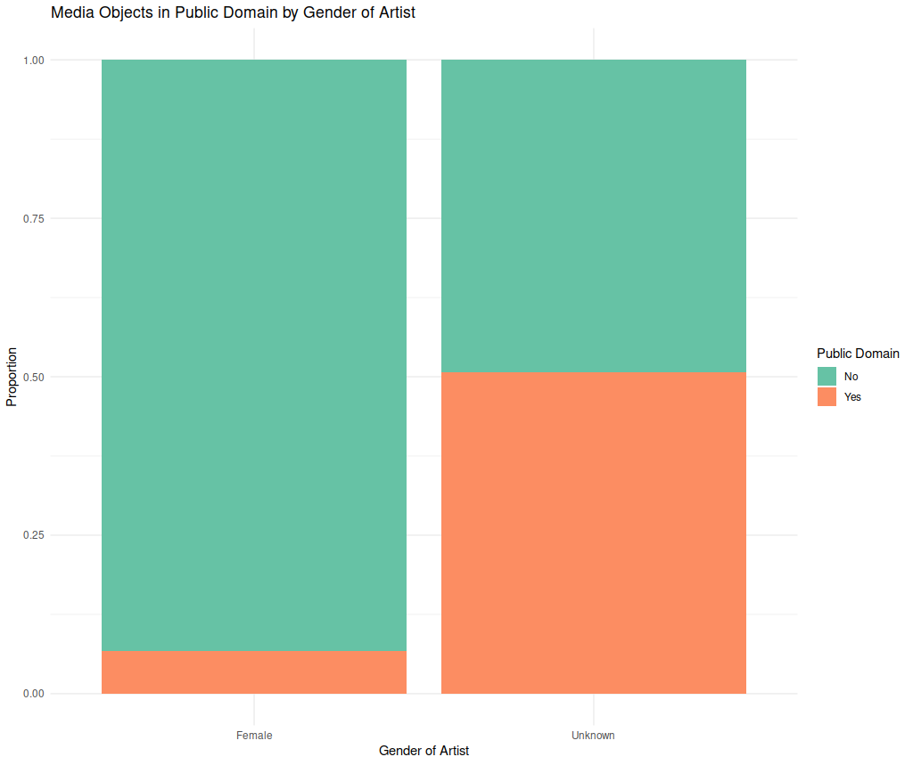

← [More Stages of Data: Analyzed](07-more-stages-of-data-analyzed.md)&nbsp;&nbsp;&nbsp;|&nbsp;&nbsp;&nbsp;[Data Literacy and Ethics](09-data-literacy-and-ethics.md) →

---

# 8. More Stages of Data: Visualized

Visualizing your data helps you tell a story and construct a narrative that guides your audience in understanding your interpretation of a collected, cleaned, and analyzed dataset. Depending on the type of analysis you ran, different kinds of visualization can be more effective than others. In the table below are some examples of data visualization that can help you convey the message of your data.

## Examples of Data Visualization
<table>
    <tr>
        <th>Types of Analysis</th>
        <th>Types of Visualization</th>
         <th>When to Use</th>
        <th>Example of Visualization</th>
    </tr>
    <tr height="300px">
        <th rowspan="3">Comparisons</th>
         <td>Bar charts</td>
         <td>Comparison across distinct categories</td>
        <td>From <a href="https://dataforgood.commons.gc.cuny.edu/report-on-covid-19s-impact-on-cuny-students/" target="_blank">The Data for Public Good</a> at the Graduate Center.</figcaption></td>
    </tr>
    <tr height="300px">
        <td>Histograms</td>
        <td>Comparison across continuous variable</td>
        <td><figcaption>From <a href="https://policyviz.com/2018/11/27/histogram-design-decisions/" target="_blank">Policy Viz.</figcaption></td>
    </tr>
    <tr height="300px">
        <td>Scatter plots</td>
        <td>Useful to check for correlation (not causation!)</td>
        <td><figcaption>From <a href="https://fivethirtyeight.com/features/the-gops-primary-rules-might-doom-carson-and-cruz/" target="_blank">FiveThirtyEight.</figcaption></td>
    </tr>
    <tr height="300px">
        <th rowspan="3">Time</th>
        <td>Stacked area charts</td>
        <td>Evolution of value across different groups</td>
        <td><figcaption>From <a href="https://www.data-to-viz.com/graph/stackedarea.html" target="_blank">From Data to Viz.</figcaption></td>
    </tr>
    <tr height="300px">
        <td>Sankey Diagrams</td>
        <td>Displaying flows of changes</td>
        <td><figcaption>From <a href="https://www.data-to-viz.com/graph/sankey.html" target="_blank">From Data to Viz.</figcaption></td>
    </tr>
   <tr height="300px">
        <td>Line graphs</td>
        <td>Tracking changes over time</td>
        <td><figcaption>From <a href="https://dataforgood.commons.gc.cuny.edu/report-on-covid-19s-impact-on-cuny-students/" target="_blank">The Data for Public Good</a> at the Graduate Center.</figcaption></td>
    </tr>
    <tr height="300px">
        <th rowspan="2">Small numbers/percentages</th>
        <td>Pie charts</td>
        <td>Demonstrate proportions between categories</td>
        <td><figcaption>From <a href="https://www.loc.gov/pictures/search/?q=%22lot%2011931%22%20NOT%20medal&st=grid&co=anedub&loclr=blogpic" target="_blank">The Library of Congress.</figcaption></td>
    </tr>
    <tr height="300px">
        <td>Tree maps</td>
        <td>Demonstrate hierarchy and proportion</td>
        <td><figcaption>From <a href="https://datavizcatalogue.com/methods/treemap.html" target="_blank">The Data Visualization Catalogue.</figcaption></td>
    </tr>
    <tr height="300px">
        <th rowspan="2">Survey responses</th>
        <td>Stacked bar charts</td>
        <td>Compares total amount across each group (e.g. plotting Likert scale)</td>
        <td><figcaption>From <a href="https://www.loc.gov/pictures/search/?q=%22lot%2011931%22%20NOT%20medal&st=grid&co=anedub&loclr=blogpic" target="_blank">The Library of Congress.</figcaption></td>
    </tr>
    <tr height="300px">
        <td>Nested area graphs</td>
        <td>Visualize branching/nested questions</td>
        <td><figcaption>From <a href="https://stephanieevergreen.com/nested-area-graph/" target="_blank">Evergreen Data.</figcaption></td>
    </tr>
    <tr height="300px">
        <th rowspan="2">Place</th>
        <td>Choropleth maps</td>
        <td>Visualize values over a geographic area to demonstrate pattern</td>
        <td><figcaption>From <a href="https://www.loc.gov/pictures/search/?q=%22lot%2011931%22%20NOT%20medal&st=grid&co=anedub&loclr=blogpic" target="_blank">The Library of Congress.</figcaption></td>
    </tr>
    <tr height="300px">
        <td>Hex(bin) or Tile maps</td>
        <td>Similar to Choropleth with the hexbin/tile representing regions equally rather than by geographic size</td>
        <td><figcaption>From <a href="https://www.r-graph-gallery.com/328-hexbin-map-of-the-usa.html" target="_blank">R Graph Gallery.</figcaption></td>
    </tr>
    <tr>
        <th colspan="4"> Adapted from <a href="https://us.sagepub.com/en-us/nam/effective-data-visualization/book265203_"> Stephanie D. Evergreen (2019) Effective data visualization : The right chart for the right data</a>, <a href="https://datavizcatalogue.com/">The Data Visualization Catalogue</a>, and <a href="https://www.data-to-viz.com/">From Data to Viz</a></th>
    <tr>
</table>

This table is a teaser for the many possibilities of what data visualization can be. Creating a visual for your data is an art form and you can sometimes find yourself spending a significant amount of time looking for the best ways to visualize your data.

An example of effective data visualization can be seen in W.E.B. Du Bois [data portraits at the Paris Exposition in 1900](https://www.loc.gov/pictures/search/?q=%22lot%2011931%22%20NOT%20medal&st=grid&co=anedub&loclr=blogpic), as part of [the Exhibit of American Negroes](https://en.wikipedia.org/wiki/The_Exhibit_of_American_Negroes_). Using engaging hand-drawn visualizations, he tells the narrative of what it meant to be Black in post-Emancipation America as he translates sociological research and census data to reach beyond the academy. Head [here](https://hyperallergic.com/476334/how-w-e-b-du-bois-meticulously-visualized-20th-century-black-america/) to read more about Du Bois' project. 

## Challenge: Visualizations

As we transform our results into visuals, we are also trying to tell a narrative about the data we collected. Data visualization can help us to decode information and share quickly and simply.

1. What are we assuming when we choose to visually represent data in particular ways? 
2. As you may have realized, many of the visualization examples work with quantitative data, as such, how do you think we can visualize qualitative data? (e.g. Word Clouds, Heat Map)
3. How can data visualization mislead us? (for e.g. Nathan Yau discusses [how data visualization can lie](https://flowingdata.com/2017/02/09/how-to-spot-visualization-lies/))
4. How can data visualization help us tell a story? (for e.g. Data Feminism's [On rational, Scientific, Objective Viewpoints from Mythical, Imaginary, Impossible Standpoints](https://data-feminism.mitpress.mit.edu/pub/5evfe9yd/release/3?readingCollection=0cd867ef))
5. Can you try to plot the `moSmall.csv` dataset based on the `Artist Gender` variable? What would you have to do before you can plot this graph? How might you explain what your visualization represents?

## Solution:  

1. An underlying assumption we make is that the conventions of top-down, left-right is universal or at least universal enough for most folx to understand. This neglects potential right-to-left readers. Certain conventions that use color as a way to represent good and bad (e.g. green as good and red as bad) also assumes that this is an effective differentiation that excludes those who have visual impairments can decipher the data in a similar fashion. 
2. Exploring [Voyant-Tools](https://voyant-tools.org/) can be a good place to start to see how visualization of qualitative data can look like. 
3. Exaggerated differences through the choice of scales on the x and y-axis can misled a casual viewer to think that the data is representing a larger difference than it actually is reporting.
4. Data visualization can help us convey dense information quickly. The casual viewer can glance at the visualization and understand what we are trying to communicate with our data. Data visualization also can be affective device, like the DuBois' examples which helps to tell the urgency of the narrative/story. 
5. The difficulty of representing this dataset is how at first glance there's an assumption that gender is binary given that only 2 bars are representing the dataset. Even though the other bar is labeled `Unknown` to suggest that this is not a comprehensive breakdown, I'm not sure how effective it is.   

---

← [More Stages of Data: Analyzed](07-more-stages-of-data-analyzed.md)&nbsp;&nbsp;&nbsp;|&nbsp;&nbsp;&nbsp;[Data Literacy and Ethics](09-data-literacy-and-ethics.md) →